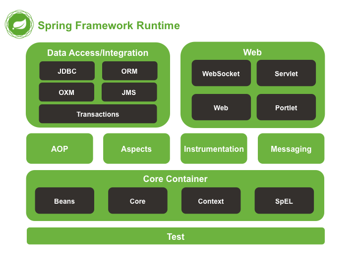

# 🌱 Lecture 25 — Spring Boot Deep Dive

A fully working **Spring Boot demo application** built for lecture purposes.  
It covers all the core Spring Boot concepts in one clean, layered project.



---

## 📋 Table of Contents

1. [What is Spring Boot?](#what-is-spring-boot)
2. [Project Structure](#project-structure)
3. [Core Concepts Covered](#core-concepts-covered)
4. [How to Run](#how-to-run)
5. [API Reference](#api-reference)
6. [Web UI](#web-ui)
7. [Architecture Diagram](#architecture-diagram)

---

## What is Spring Boot?

**Spring Boot** is a framework built on top of the Spring Framework.  
Its goal: **get a production-ready application running with almost zero configuration.**

| Concept | Explanation |
|---|---|
| **Auto-configuration** | Looks at your classpath and configures beans automatically (sees MySQL driver → sets up DataSource) |
| **Starter dependencies** | `spring-boot-starter-web` pulls in Tomcat + Jackson + Spring MVC in one line |
| **Embedded server** | No need to deploy a WAR. Runs as a plain `java -jar` |
| **Opinionated defaults** | Sensible defaults out of the box; easy to override |

---

## Project Structure

```
src/main/java/ge/edu/freeuni/
│
├── Lecture25Application.java        ← Entry point (@SpringBootApplication)
├── DataSeeder.java                  ← Seeds DB on startup (CommandLineRunner)
│
├── model/
│   └── Student.java                 ← JPA Entity
│
├── dto/
│   ├── StudentRequest.java          ← Incoming data + validation rules
│   └── StudentResponse.java         ← Outgoing data (controlled view)
│
├── repository/
│   └── StudentRepository.java       ← Spring Data JPA (CRUD for free)
│
├── service/
│   ├── StudentService.java          ← Interface (contract)
│   └── StudentServiceImpl.java      ← Implementation (@Service, @Transactional)
│
├── controller/
│   ├── StudentController.java       ← REST endpoints (/api/students)
│   ├── StudentWebController.java    ← Thymeleaf MVC endpoints (/ui/students)
│   ├── RootController.java          ← Redirects / → /ui/students
│   └── AppInfoController.java       ← Shows @ConfigurationProperties demo
│
├── exception/
│   ├── StudentNotFoundException.java
│   ├── ErrorResponse.java
│   └── GlobalExceptionHandler.java  ← @RestControllerAdvice
│
└── config/
    ├── AppProperties.java           ← @ConfigurationProperties(prefix="app")
    └── SecurityConfig.java          ← Spring Security rules
```

---

## Core Concepts Covered

---

### 1. `@SpringBootApplication`

**File:** `Lecture25Application.java`

```java
@SpringBootApplication          // = @Configuration + @EnableAutoConfiguration + @ComponentScan
@ConfigurationPropertiesScan    // activates all @ConfigurationProperties beans
public class Lecture25Application {
    public static void main(String[] args) {
        SpringApplication.run(Lecture25Application.class, args);
    }
}
```

`@SpringBootApplication` combines three annotations:

| Annotation | What it does |
|---|---|
| `@Configuration` | This class can define `@Bean` methods |
| `@EnableAutoConfiguration` | Spring Boot auto-configures based on classpath |
| `@ComponentScan` | Scans the package for `@Component`, `@Service`, `@Repository`, etc. |

---

### 2. `application.properties`

**File:** `src/main/resources/application.properties`

The central configuration file. Spring Boot reads it **automatically** on startup — no manual loading required.

```properties
# Server
server.port=8081

# MySQL Database (Docker)
# Start DB first: docker compose up -d
spring.datasource.url=jdbc:mysql://localhost:3307/lecture25db?useSSL=false&allowPublicKeyRetrieval=true&serverTimezone=UTC
spring.datasource.driver-class-name=com.mysql.cj.jdbc.Driver
spring.datasource.username=lecture25user
spring.datasource.password=lecture25pass

# JPA / Hibernate
# update  = alter existing tables (keeps data between restarts)
# create  = drop + recreate on every start (use for demo resets)
spring.jpa.hibernate.ddl-auto=update
spring.jpa.show-sql=true
spring.jpa.properties.hibernate.dialect=org.hibernate.dialect.MySQLDialect

# Security — credentials read from environment variables at runtime.
# The values after the colon (:) are fallback defaults for local dev only.
# Set real values before starting: $env:ADMIN_USERNAME="..."; $env:ADMIN_PASSWORD="..."
app.security.admin-username=${ADMIN_USERNAME:admin}
app.security.admin-password=${ADMIN_PASSWORD:admin123}

# Custom properties — bound to AppProperties bean
app.name=Student Manager
app.max-students=100
app.welcome-message=Welcome to the Spring Boot demo!
```

> ⚠️ **Never hardcode credentials in `application.properties`** — this file is committed to Git.  
> Always read sensitive values from **environment variables**.

---

### 3. JPA Entity

**File:** `model/Student.java`

```java
@Entity                      // marks this class as a database table
@Table(name = "students")    // table name in the DB
public class Student {

    @Id
    @GeneratedValue(strategy = GenerationType.IDENTITY)  // auto-increment primary key
    private Long id;

    @Column(nullable = false, unique = true)
    private String email;

    @Enumerated(EnumType.STRING)   // stores "COMPUTER_SCIENCE", not 0, 1, 2...
    private Major major;

    public enum Major { COMPUTER_SCIENCE, MATHEMATICS, PHYSICS, BUSINESS }
}
```

**JPA (Java Persistence API)** is a specification that maps Java objects ↔ database rows.  
**Hibernate** is the JPA implementation Spring Boot auto-configures under the hood.  
With `ddl-auto=update`, Hibernate **creates or updates the `students` table automatically** — no SQL script needed.

---

### 4. Spring Data Repository

**File:** `repository/StudentRepository.java`

```java
public interface StudentRepository extends JpaRepository<Student, Long> {

    // Spring generates: SELECT * FROM students WHERE email = ?
    Optional<Student> findByEmail(String email);

    // Spring generates: SELECT * FROM students WHERE major = ?
    List<Student> findByMajor(Student.Major major);

    // Custom JPQL query (object-oriented SQL)
    @Query("SELECT s FROM Student s WHERE s.age >= :minAge")
    List<Student> findStudentsOlderThan(int minAge);
}
```

Extending `JpaRepository<Student, Long>` gives you **for free**:

| Method | SQL |
|---|---|
| `findAll()` | `SELECT * FROM students` |
| `findById(1L)` | `SELECT * FROM students WHERE id = 1` |
| `save(student)` | `INSERT` or `UPDATE` |
| `deleteById(1L)` | `DELETE FROM students WHERE id = 1` |
| `count()` | `SELECT COUNT(*) FROM students` |

You just **declare method names** — Spring generates the SQL automatically.

---

### 5. DTO & Validation

**Files:** `dto/StudentRequest.java`, `dto/StudentResponse.java`

> ⚠️ **Rule:** Never expose JPA Entities directly in the API.  
> Entities are internal — DTOs control exactly what goes in and out.

```java
// REQUEST DTO: what the client sends in the request body
public class StudentRequest {

    @NotBlank(message = "Name is required")
    @Size(min = 2, max = 100, message = "Name must be 2-100 characters")
    private String name;

    @Email(message = "Email must be valid")
    private String email;

    @Min(value = 16, message = "Age must be at least 16")
    @Max(value = 100, message = "Age must be at most 100")
    private int age;

    @NotNull(message = "Major is required")
    private Student.Major major;
}
```

```java
// RESPONSE DTO: what the client receives
public class StudentResponse {
    private Long id;
    private String name;
    private String email;
    private int age;
    private Student.Major major;

    // Factory method: converts Entity -> DTO
    public static StudentResponse from(Student student) { ... }
}
```

Validation annotations are checked automatically when `@Valid` is placed in the controller.  
If any fail → `GlobalExceptionHandler` returns a `400 Bad Request` with a clear message.

---

### 6. Service Layer

**Files:** `service/StudentService.java` (interface), `service/StudentServiceImpl.java`

```java
@Slf4j               // Lombok: generates  private static final Logger log = ...
@Service             // marks as a Spring bean in the business logic layer
@RequiredArgsConstructor  // Lombok: constructor injection (recommended over @Autowired)
public class StudentServiceImpl implements StudentService {

    private final StudentRepository studentRepository;

    @Transactional(readOnly = true)   // read-only transaction — DB optimization
    public List<StudentResponse> getAllStudents() {
        log.info("Fetching all students");
        return studentRepository.findAll()
            .stream()
            .map(StudentResponse::from)   // Entity -> DTO
            .toList();
    }

    @Transactional   // wraps the DB operation in a transaction (all-or-nothing)
    public StudentResponse createStudent(StudentRequest request) { ... }
}
```

**Why a separate service layer?**
- Controller handles **HTTP** — service handles **business logic** (separation of concerns)
- Easy to unit-test by mocking the repository
- `@Transactional` ensures DB operations are atomic — if something fails, everything rolls back

---

### 7. REST Controller

**File:** `controller/StudentController.java`

```java
@RestController           // = @Controller + @ResponseBody (auto JSON serialization)
@RequestMapping("/api/students")
@RequiredArgsConstructor
public class StudentController {

    private final StudentService studentService;

    @GetMapping               // GET  /api/students
    public List<StudentResponse> getAllStudents() { ... }

    @GetMapping("/{id}")      // GET  /api/students/1
    public StudentResponse getStudentById(@PathVariable Long id) { ... }

    @GetMapping("/major/{major}")  // GET /api/students/major/COMPUTER_SCIENCE
    public List<StudentResponse> getByMajor(@PathVariable Student.Major major) { ... }

    @PostMapping              // POST /api/students
    public ResponseEntity<StudentResponse> createStudent(
        @Valid @RequestBody StudentRequest request   // @Valid triggers bean validation
    ) { ... }

    @PutMapping("/{id}")      // PUT  /api/students/1
    public StudentResponse updateStudent(...) { ... }

    @DeleteMapping("/{id}")   // DELETE /api/students/1
    public ResponseEntity<Void> deleteStudent(...) { ... }
}
```

`@ResponseBody` tells Spring to serialize the Java return value to **JSON** automatically using the **Jackson** library.

---

### 8. Thymeleaf MVC Controller

**File:** `controller/StudentWebController.java`

```java
@Controller           // returns template names, not JSON
@RequestMapping("/ui")
@RequiredArgsConstructor
public class StudentWebController {

    private final StudentService studentService;

    @GetMapping("/students")
    public String listStudents(@RequestParam(required = false) String major, Model model) {

        List<StudentResponse> students;
        if (major != null && !major.isBlank()) {
            students = studentService.getStudentsByMajor(Student.Major.valueOf(major));
            model.addAttribute("selectedMajor", major);
        } else {
            students = studentService.getAllStudents();
            model.addAttribute("selectedMajor", "");
        }
        model.addAttribute("students", students);

        // Count CS students in Java — Thymeleaf/SpEL does NOT support lambdas
        long csCount = students.stream()
                .filter(s -> s.getMajor() == Student.Major.COMPUTER_SCIENCE)
                .count();
        model.addAttribute("csCount", csCount);
        model.addAttribute("majors", Student.Major.values());
        return "students/list";   // renders templates/students/list.html
    }

    @GetMapping("/login")
    public String loginPage() { return "login"; }

    // also handles: /students/new, POST /students,
    //               /students/{id}/edit, POST /students/{id}/edit,
    //               POST /students/{id}/delete
}
```

> ⚠️ **Important:** Thymeleaf uses **Spring EL (SpEL)**, which does **NOT** support Java lambda expressions.  
> Never write `${students.stream().filter(s -> ...).count()}` in a template — it throws a 500 error.  
> Always compute such values in the controller and pass them as model attributes.

---

### 9. Root Redirect Controller

**File:** `controller/RootController.java`

```java
@Controller
public class RootController {

    @GetMapping("/")
    public String root() {
        return "redirect:/ui/students";
    }
}
```

Navigating to `localhost:8081` (bare root) redirects to the students list instead of showing a Whitelabel error page.

---

### 10. Global Exception Handling

**File:** `exception/GlobalExceptionHandler.java`

```java
@RestControllerAdvice    // intercepts exceptions thrown from ANY controller
public class GlobalExceptionHandler {

    // 404 — resource not found
    @ExceptionHandler(StudentNotFoundException.class)
    public ResponseEntity<ErrorResponse> handleNotFound(StudentNotFoundException ex) {
        return ResponseEntity.status(404)
            .body(new ErrorResponse(404, ex.getMessage(), LocalDateTime.now()));
    }

    // 400 — validation failed (@Valid)
    @ExceptionHandler(MethodArgumentNotValidException.class)
    public ResponseEntity<ErrorResponse> handleValidation(...) { ... }

    // 500 — anything unexpected
    @ExceptionHandler(Exception.class)
    public ResponseEntity<ErrorResponse> handleGeneric(...) { ... }
}
```

> ⚠️ **Note:** `GlobalExceptionHandler` does **NOT** handle invalid login credentials.  
> Spring Security intercepts authentication **before** reaching any controller — your handler is never called for login failures.  
> On bad credentials, Security automatically redirects to `/ui/login?error`.  
> To show an error message in the login page:
> ```html
> <div th:if="${param.error}">Invalid username or password.</div>
> ```

Without this handler, Spring would return an HTML Whitelabel error page.  
With `@RestControllerAdvice`, every API error returns **consistent JSON**:

```json
{
  "status": 404,
  "message": "Student not found with id: 999",
  "timestamp": "2026-05-24T16:29:00"
}
```

---

### 11. Spring Security

**File:** `config/SecurityConfig.java`

Credentials are injected from `AppProperties` (which reads from **environment variables**) and the password is hashed with **BCrypt** — never stored in plaintext.

```java
@Configuration
@EnableWebSecurity
@RequiredArgsConstructor
public class SecurityConfig {

    private final AppProperties appProperties;

    /** BCrypt hashes passwords with a random salt — industry standard. */
    @Bean
    public PasswordEncoder passwordEncoder() {
        return new BCryptPasswordEncoder();
    }

    /**
     * Reads username/password from environment variables via AppProperties.
     * Hashes the password with BCrypt before storing it in memory.
     */
    @Bean
    public UserDetailsService userDetailsService(PasswordEncoder encoder) {
        var admin = User.builder()
            .username(appProperties.getSecurity().getAdminUsername())
            .password(encoder.encode(appProperties.getSecurity().getAdminPassword()))
            .roles("ADMIN")
            .build();
        return new InMemoryUserDetailsManager(admin);
    }

    @Bean
    public SecurityFilterChain filterChain(HttpSecurity http) throws Exception {
        http
            .authorizeHttpRequests(auth -> auth
                .requestMatchers("/h2-console/**").permitAll()
                .requestMatchers("/actuator/**").permitAll()
                .requestMatchers("/css/**", "/js/**", "/images/**").permitAll()
                .requestMatchers("/error").permitAll()          // prevent auth redirect loops
                .requestMatchers("/ui/login").permitAll()
                .requestMatchers(GET, "/api/**").permitAll()    // all GETs are public
                .requestMatchers(GET, "/ui/**").permitAll()     // read pages are public
                .anyRequest().authenticated()                   // everything else requires login
            )
            .formLogin(form -> form
                .loginPage("/ui/login")
                .defaultSuccessUrl("/ui/students", true)
                .permitAll()
            )
            .logout(logout -> logout
                .logoutUrl("/ui/logout")
                .logoutSuccessUrl("/ui/students")
                .permitAll()
            )
            .httpBasic(Customizer.withDefaults())               // Basic Auth for /api/**
            .csrf(csrf -> csrf.ignoringRequestMatchers("/h2-console/**", "/api/**"));
        return http.build();
    }
}
```

| Request | Auth required? |
|---|---|
| `GET /api/students` | ❌ No |
| `GET /ui/students` | ❌ No |
| `POST /api/students` | ✅ Yes (Basic Auth) |
| `PUT /api/students/1` | ✅ Yes (Basic Auth) |
| `DELETE /api/students/1` | ✅ Yes (Basic Auth) |
| `POST /ui/students` (create/edit/delete via form) | ✅ Yes (Form Login) |

---

### 12. `@ConfigurationProperties`

**File:** `config/AppProperties.java`

```java
@Component
@ConfigurationProperties(prefix = "app")
@Getter @Setter
public class AppProperties {

    private String name;           // ← app.name
    private int maxStudents;       // ← app.max-students
    private String welcomeMessage; // ← app.welcome-message

    /** Nested group — binds app.security.* properties */
    private Security security = new Security();

    @Getter @Setter
    public static class Security {
        private String adminUsername;  // ← app.security.admin-username → $ADMIN_USERNAME
        private String adminPassword;  // ← app.security.admin-password → $ADMIN_PASSWORD
    }
}
```

Instead of using `@Value("${app.name}")` scattered across many classes, you get a **single, strongly-typed, injectable bean**.  
The nested `Security` class groups all credential-related config under one roof and is injected directly into `SecurityConfig`.

**Try it:** `GET http://localhost:8081/api/info`
```json
{
  "appName": "Student Manager",
  "maxStudents": 100,
  "welcomeMessage": "Welcome to the Spring Boot demo!"
}
```

---

### 13. `CommandLineRunner` — Data Seeding

**File:** `DataSeeder.java`

```java
@Slf4j
@Component
@RequiredArgsConstructor
public class DataSeeder implements CommandLineRunner {

    private final StudentRepository studentRepository;

    @Override
    public void run(String... args) {           // called once, after context fully loads
        log.info("Seeding sample students...");

        studentRepository.saveAll(List.of(
            new Student(null, "Alice Johnson",  "alice@freeuni.edu.ge", 20, COMPUTER_SCIENCE),
            new Student(null, "Bob Smith",      "bob@freeuni.edu.ge",   22, MATHEMATICS),
            new Student(null, "Carol Williams", "carol@freeuni.edu.ge", 19, PHYSICS),
            new Student(null, "David Brown",    "david@freeuni.edu.ge", 21, BUSINESS),
            new Student(null, "Eve Davis",      "eve@freeuni.edu.ge",   23, COMPUTER_SCIENCE)
        ));

        log.info("Seeded {} students.", studentRepository.count());
    }
}
```

`CommandLineRunner` is a Spring Boot hook — implement it in any `@Component` and your code runs **exactly once after the application starts fully**.  
Common uses: seeding demo data, startup health checks, pre-loading caches.

> ⚠️ Because `ddl-auto=update` keeps data between restarts, `DataSeeder` checks if the DB is empty before inserting to avoid duplicate email errors.

---

### 14. Actuator

Spring Boot Actuator exposes **production-ready monitoring endpoints** with zero code from you.

| Endpoint | Description |
|---|---|
| `GET /actuator/health` | `{"status":"UP"}` — is the app alive? |
| `GET /actuator/info` | App name & version from `application.properties` |
| `GET /actuator/metrics` | JVM memory, HTTP request counts, thread info |

```properties
management.endpoints.web.exposure.include=health,info,metrics
info.app.name=Lecture25 Spring Boot Demo
info.app.version=1.0.0
```

---

## How to Run

### Prerequisites
- Java 17 or higher
- Maven 3.6+
- Docker Desktop (for MySQL)

### 1. Start the MySQL database
```bash
cd Lectures/Lecture25
docker compose up -d
```

### 2. (Optional) Set custom credentials via environment variables

If you don't set these, the app falls back to `admin` / `admin123` — **for local dev only**.

```powershell
# PowerShell
$env:ADMIN_USERNAME = "myadmin"
$env:ADMIN_PASSWORD = "MyStr0ngP@ssword!"
```

```bash
# bash / Linux / macOS
export ADMIN_USERNAME=myadmin
export ADMIN_PASSWORD=MyStr0ngP@ssword!
```

### 3. Start the application
```bash
mvn spring-boot:run
```

App starts at **http://localhost:8081**

On startup you will see in the logs:
```
Seeding sample students...
Seeded 5 students.
Started Lecture25Application in X.XXX seconds
```

### Connect to the database

**Inside the container (MySQL shell):**
```bash
docker exec -it lecture25-mysql mysql -u lecture25user -plecture25pass lecture25db
```

**From IntelliJ Database tool:**

| Field | Value |
|---|---|
| Host | `localhost` |
| Port | `3307` |
| Database | `lecture25db` |
| User | `lecture25user` |
| Password | `lecture25pass` |

---

## API Reference

> **Base URL:** `http://localhost:8081`  
> **Auth:** HTTP Basic — use the credentials set via `ADMIN_USERNAME` / `ADMIN_PASSWORD` env vars (default: `admin` / `admin123`)

| Method | URL | Auth | Description |
|---|---|---|---|
| `GET` | `/api/students` | ❌ | List all students |
| `GET` | `/api/students/{id}` | ❌ | Get student by ID |
| `GET` | `/api/students/major/{major}` | ❌ | Filter by major |
| `POST` | `/api/students` | ✅ | Create a new student |
| `PUT` | `/api/students/{id}` | ✅ | Update a student |
| `DELETE` | `/api/students/{id}` | ✅ | Delete a student |
| `GET` | `/api/info` | ❌ | Show custom config properties |
| `GET` | `/actuator/health` | ❌ | Health check |
| `GET` | `/actuator/info` | ❌ | App metadata |

**Available majors:** `COMPUTER_SCIENCE` | `MATHEMATICS` | `PHYSICS` | `BUSINESS`

### Create a student
```bash
curl -X POST http://localhost:8081/api/students \
  -u admin:admin123 \
  -H "Content-Type: application/json" \
  -d '{
    "name": "Giorgi Beridze",
    "email": "giorgi@freeuni.edu.ge",
    "age": 21,
    "major": "COMPUTER_SCIENCE"
  }'
```

Response `201 Created`:
```json
{
  "id": 6,
  "name": "Giorgi Beridze",
  "email": "giorgi@freeuni.edu.ge",
  "age": 21,
  "major": "COMPUTER_SCIENCE"
}
```

### Validation error (400)
```bash
curl -X POST http://localhost:8081/api/students \
  -u admin:admin123 \
  -H "Content-Type: application/json" \
  -d '{"name":"","email":"bad-email","age":5,"major":"COMPUTER_SCIENCE"}'
```

Response `400 Bad Request`:
```json
{
  "status": 400,
  "message": "Email must be valid, Age must be at least 16, Name is required",
  "timestamp": "2026-05-24T16:00:00"
}
```

### Not found (404)
```
GET /api/students/999
```

Response `404 Not Found`:
```json
{
  "status": 404,
  "message": "Student not found with id: 999",
  "timestamp": "2026-05-24T16:00:00"
}
```

---

## Web UI

The app includes a full Thymeleaf web interface at **http://localhost:8081/ui/students**

| URL | Description | Auth |
|---|---|---|
| `GET /` | Redirects to `/ui/students` | ❌ |
| `GET /ui/students` | List all students | ❌ |
| `GET /ui/students/new` | New student form | ❌ |
| `POST /ui/students` | Submit create form | ✅ |
| `GET /ui/students/{id}/edit` | Edit student form | ❌ |
| `POST /ui/students/{id}/edit` | Submit update form | ✅ |
| `POST /ui/students/{id}/delete` | Delete student | ✅ |
| `GET /ui/login` | Login page | ❌ |
| `POST /ui/logout` | Logout | ✅ |

Login with the credentials set via environment variables (default: `admin` / `admin123`) to create, edit, or delete students.

---

## Architecture Diagram

```
Browser / curl
     │
     ▼
┌──────────────────────────┐
│      Spring Security     │  SecurityConfig
│  authenticate/authorize  │  credentials from env vars → BCrypt hashed
│  handles login/logout    │  bad credentials → redirect /ui/login?error
└──────────┬───────────────┘  (GlobalExceptionHandler is NOT involved here)
           │
           ▼
┌──────────────────────────────────────────────┐
│               Controllers                    │
│  REST:  StudentController  → JSON response   │  @RestController
│  Web:   StudentWebController → HTML template │  @Controller (Thymeleaf)
│  Root:  RootController  → redirect /         │
└──────────┬───────────────────────────────────┘
           │  ↑ @Valid validates request body/form here
           ▼
┌──────────────────────────┐
│      Service Layer       │  @Service + @Transactional
│     business logic       │  StudentServiceImpl
└──────────┬───────────────┘
           │
           ▼
┌──────────────────────────┐
│       Repository         │  JpaRepository (Spring Data)
│     database access      │  StudentRepository
└──────────┬───────────────┘
           │
           ▼
┌──────────────────────────┐
│    MySQL (Docker)        │  Hibernate manages schema & SQL
│    localhost:3307        │  container: lecture25-mysql
└──────────────────────────┘

Any exception from a controller bubbles up to:
┌──────────────────────────┐
│  GlobalExceptionHandler  │  @RestControllerAdvice (API errors only)
│  clean JSON error body   │  { status, message, timestamp }
└──────────────────────────┘
```

---

> **Lecture 25** | Free University of Tbilisi | OOP 2026

