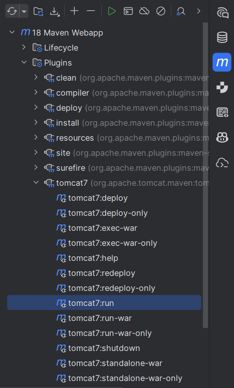

## Web - Servlets

1. JSP - შექმენით ფორმა, რომლითაც შევძლებთ სტუდენტების დამატებას.
2. შექმენით შესაბამისი სერვლეტები, რომლებიც დაამუშავებენ კლიენტის მოთხოვნებს. დაიცავით thread-safety.

--------------------
Tomcat plugin

```xml

<plugin>
    <groupId>org.apache.tomcat.maven</groupId>
    <artifactId>tomcat7-maven-plugin</artifactId>
    <version>2.2</version>
    <configuration>
        <port>8080</port>
        <path>/</path>
    </configuration>
</plugin>
```

Servlets dependency

```xml
<dependency>
    <groupId>javax.servlet</groupId>
    <artifactId>javax.servlet-api</artifactId>
    <version>4.0.1</version>
    <scope>provided</scope>
</dependency>
```
--------------------

## Maven Archetype - ინტელიჯეიდან web მოდულის შექმნა

1. **New → Module**
2. **Generators → Maven Archetype**
3. შეავსეთ დეტალები:
    - **Name:** მაგალითად `my-webapp`
    - **Location:** მოდულის ფოლდერი
    - **JDK:** მაგალითად 1.8
4. **Archetype**-ში აირჩიეთ:
   ```
   maven-archetype-webapp
   ```

> 💡 Create-ზე დაჭერით ინტელიჯეი შეგიქმნით default სტრუქტურას და გადმოწერს default დიფენდენსიებს.

სტანდარტული მეივენის სტრუქტურა ასეთი გენერაციისას:

```
my-webapp/
├── pom.xml
└── src/
    └── main/
        ├── java/
        ├── resources/
        └── webapp/
            ├── index.jsp
            └── WEB-INF/
                └── web.xml
```

გენერაციის შემდეგ, გახსენით `pom.xml` და დაამატეთ საჭირო დიფენდენსიები და ფლაგინები როგორც ზემოთაა.

---
### სერვერის გაშვება:



ან ტერმინალში:

```shell
mvn tomcat7:run
```
