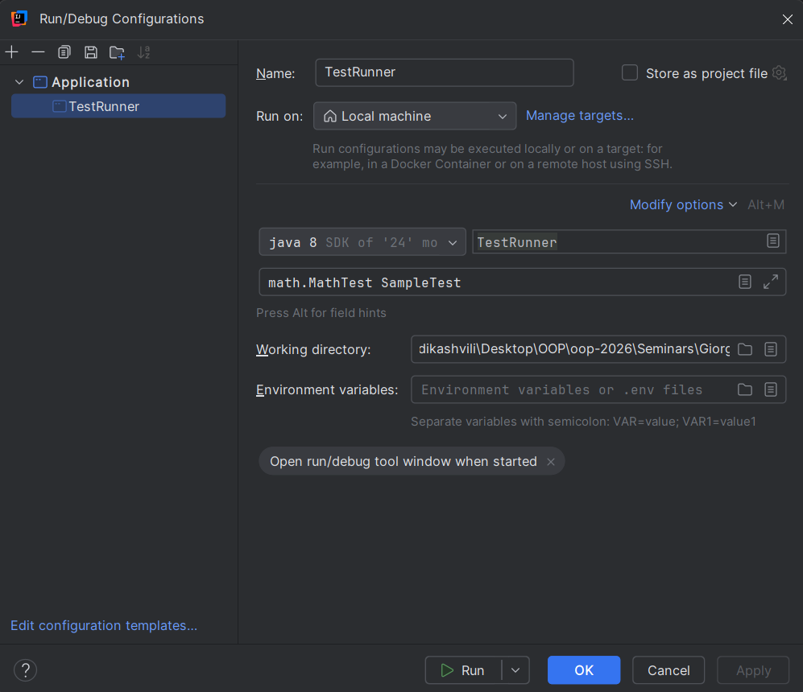

## Reflections, Annotations

დააიმპლემენტირეთ თქვენი მინი სატესტო ფრეიმვორკი (JUnit-ის მსგავსი).
* დააიმპლემენტირეთ საკუთარი @Test და @BeforeEach ანოტაციები.
* დაწერეთ ტესტების პროცესორი კლასი რეფლექშენით.

---

გაშვება:

